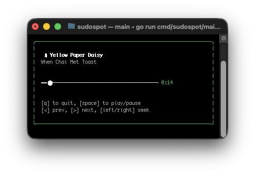

<!DOCTYPE html>
<html lang="en">
<head>
<meta charset="UTF-8">
<meta name="viewport" content="width=device-width, initial-scale=1.0">

</head>
<body>

<header>
<h1>

 
SudoSpot: Spotify Terminal Player
</h1>
</header>

SudoSpot is a minimalist, cross-platform Spotify client built for the command line. It uses the <a href="https://github.com/charmbracelet/bubbletea">Bubble Tea TUI framework</a> and the Spotify Web API to provide real-time status and playback control for any device connected to your Spotify account (phone, TV, desktop).

<section>
<h2>Features</h2>
<ul>
<li><strong>Real-time Status:</strong> Displays the currently playing track, artist, and progress.</li>
<li><strong>Universal Control:</strong> Control music playing on <strong>any device</strong> linked to your Spotify account.</li>
<li><strong>Full Playback Control:</strong> Play, pause, skip, and seek directly from the terminal.</li>
<li><strong>Cool Visualizer Line:</strong> A stylized progress bar acts as a visualizer line, showing the current progress through the track.</li>
</ul>

</section>

<section>
<h2>Installation</h2>

<h3>Prerequisites</h3>
<ul>
<li>Go (1.18+)</li>
<li>A Spotify Developer Account (to get your Client ID and Secret).</li>
<li>Set the <strong>Redirect URI</strong> in your Spotify App settings to: <code>http://127.0.0.1:8080/callback</code></li>
</ul>

<h3>Running the Application</h3>

1. **Install SudoSpot** using the Go toolchain:

<pre><code>go install github.com/Sudo-Aju/sudospot/cmd/sudospot@latest</code></pre>

2. Run SudoSpot from your terminal:

<pre><code>sudospot</code></pre>

(SudoSpot will prompt you to enter your Spotify Client ID and Secret upon first run.)

<h3>First-Time Authentication</h3>

The first time you run SudoSpot, it will prompt you for your Client ID and Secret, and then proceed with the URL authentication:

<pre><code>Please log in to Spotify by visiting the following page in your browser:
http://127.0.0.1:8080/callback?state=...</code></pre>
<ol>
<li>Open the URL in your browser to authorize SudoSpot.</li>
<li>Once authorized, the terminal will automatically launch the player.</li>
<li>SudoSpot saves a token (<code>token.json</code>) locally, so you won't need to log in again.</li>
</ol>
</section>

<section>
<h2>Controls</h2>

SudoSpot allows you to control the active Spotify playback on any device connected to your account.

<table>
<thead>
<tr>
<th>Key</th>
<th>Action</th>
<th>Description</th>
</tr>
</thead>
<tbody>
<tr>
<th>Space</th>
<td>Play / Pause Toggle</td>
<td>Pauses the currently playing track or resumes playback.</td>
</tr>
<tr>
<th>&gt;</th>
<td>Next Track</td>
<td>Skips to the next song in the queue.</td>
</tr>
<tr>
<th>&lt;</th>
<td>Previous Track</td>
<td>Skips back to the previous song.</td>
</tr>
<tr>
<th>Right Arrow</th>
<td>Seek Forward (10s)</td>
<td>Jumps the playback 10 seconds ahead in the track.</td>
</tr>
<tr>
<th>Left Arrow</th>
<td>Seek Backward (10s)</td>
<td>Jumps the playback 10 seconds back in the track.</td>
</tr>
<tr>
<th>Q</th>
<td>Quit</td>
<td>Exits the SudoSpot application gracefully.</td>
</tr>
</tbody>
</table>

</section>

<section>

<h2>Attribution</h2>

SudoSpot is built on the shoulders of these fantastic Go libraries:

<ul>
<li><a href="https://github.com/charmbracelet/bubbletea">Bubble Tea</a>: The powerful TUI framework.</li>
<li><a href="https://github.com/zmb3/spotify/v2">go-spotify-client</a>: The robust Spotify Web API wrapper.</li>
</ul>

<h2>Contributing</h2>

Contributions are welcome! Feel free to open an issue or submit a pull request if you have ideas for improvements or new features.

</section>

</body>
</html>
